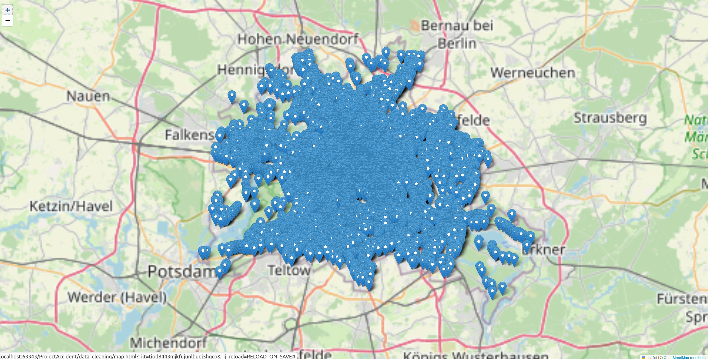
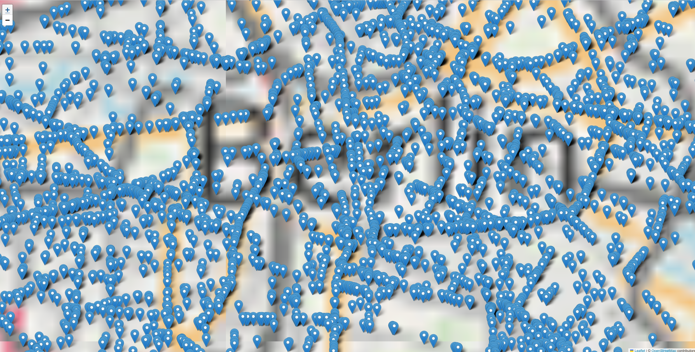

# Accidents In Berlin/ Unfallrisiko AI Berlin

 -Team 4- 
Anne Quinkenstein, Cindy Stammberger, Karenina Schröder

---

Unser Projekt beschäftigt sich mit Straßenverkehrsunfällen in Berlin. Die Ergebnisse unserer Analyse werden in der Streamlit App dargestellt.
In der StreamliteApp kann man die Bedingungen eingeben, unter denen man einen Unfall befürchtet, um rauszufinden, ob er schwerwiegend sein könnte.
Mit den open Data von Berlin wird die Wahrscheinlichkeit für die Unfallschwere mit dem Machine Learning-Algorithmus 'Random Forest' vorhergesagt.
Wir können allerdings keine Aussage darüber treffen, ob man einen Unfall haben wird.

* Um die App zu starten, führen Sie bitte die Datei *../modelle_getuned/Rf_Rs_Gridgetuned.ipynb* aus.
* Dadurch wird die Datei *../modelle_getuned/random_forest_model.pkl* erstellt. 
* In dem Skript *../infos/streamlitAppTest.py* wird die pkl Datei geladen und die StreamlitApp gestartet. 

Um die StreamlitApp in Ihrem Browser zu öffnen, gehen Sie in den Ordner *infos* und führen Sie bitte das Skript *../infos/streamlitAppTest.py* aus mit dem Befehl `streamlit run streamlitAppTest.py`.

